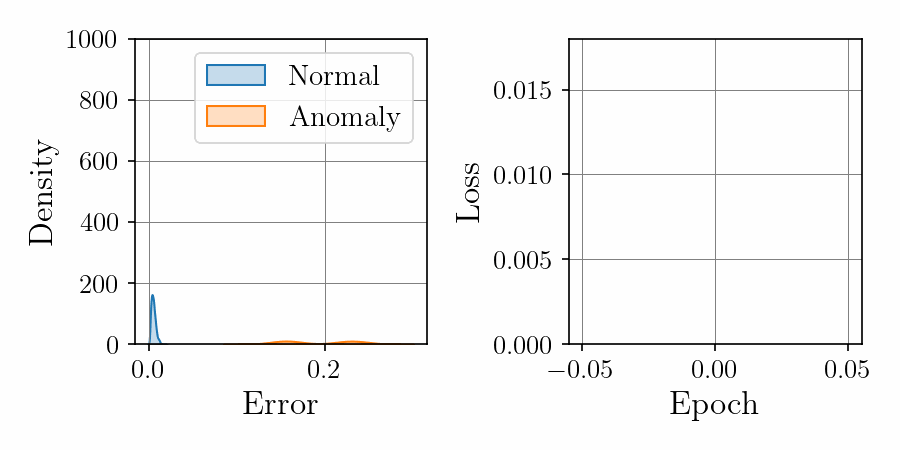
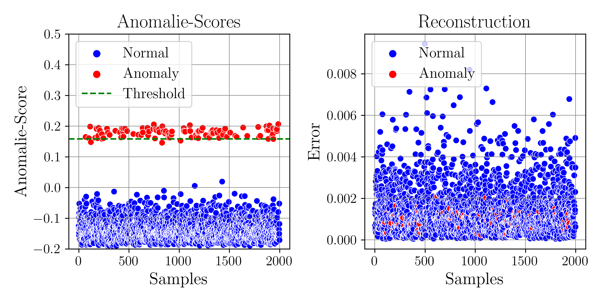

# Hybrid Isolation Forest + Autoencoder for Anomaly Detection

In high-dimensional systems, traditional anomaly detection models often fail to generalize across noise, corruption, or synthetic data distributions. This repository presents a **hybrid approach** combining:

* **Isolation Forests** for fast, tree-based anomaly scoring
* **Autoencoders** for deep reconstruction-based anomaly detection

Together, they provide a robust and interpretable pipeline for **synthetic anomaly detection in time-series cost data**.

---

## 📈 Training Progress (Autoencoder Loss + Error Distributions)

<p align="center">
  
</p>

---

## 🧠 Method Overview

1. **Synthetic cost data generation**
2. **Min-Max scaling + train/test split**
3. **Isolation Forest scoring**
4. **Autoencoder training (MSE loss + Adam optimizer)**
5. **Quantile-based thresholding (95%)**
6. **Evaluation (ROC-AUC + classification report)**

The reconstruction errors from the autoencoder and the decision function of the Isolation Forest are used to classify normal vs. anomalous behavior.

---

## 📊 Final Evaluation

<p align="center">
  
</p>

---

## 📦 Prerequisites

Make sure the following libraries are installed:

```bash
pip install numpy matplotlib seaborn scikit-learn torch
```

Recommended: Run in a virtual environment (e.g., `venv` or `conda`).

---

## 🚀 Getting Started

Clone this repository and run the following code
```bash
git clone https://github.com/diyarino/anomaly-detection-with-isolation-forest-and-autoencoder/.git
cd anomaly-detection-with-isolation-forest-and-autoencoder/
python main.py
```

---

## 🧬 Architecture: Autoencoder

A simple fully connected autoencoder is used for unsupervised feature learning:

```
Input → FC (ReLU) → Bottleneck → FC (ReLU) → Output
```

Training minimizes the mean squared error (MSE) between inputs and outputs.

---

## 📂 Project Structure

```
├── dataset.py                     # Synthetic data generator
├── config_plots.py                # Plotting configuration
├── network.py                     # Autoencoder architecture
├── main.py                        # Full training and evaluation script
├── training_progress/             # Autoencoder training snapshots
├── training_progress.gif          # Autoencoder training animation
├── anomaly_detection_comparison.png # Final comparison plot
└── README.md                      # Project documentation
```

---

## 📚 Related Work

Below are selected related works and projects that inspired or complement this research:

<a id="1">[1]</a> Altinses, D., & Schwung, A. (2023, October). Multimodal Synthetic Dataset Balancing: A Framework for Realistic and Balanced Training Data Generation in Industrial Settings. In IECON 2023-49th Annual Conference of the IEEE Industrial Electronics Society (pp. 1-7). IEEE.

<a id="2">[2]</a> Altinses, D., & Schwung, A. (2025). Performance benchmarking of multimodal data-driven approaches in industrial settings. Machine Learning with Applications, 100691.

<a id="3">[3]</a> Altinses, D., & Schwung, A. (2023, October). Deep Multimodal Fusion with Corrupted Spatio-Temporal Data Using Fuzzy Regularization. In IECON 2023-49th Annual Conference of the IEEE Industrial Electronics Society (pp. 1-7). IEEE.

<a id="3">[4]</a> Altinses, D., Torres, D. O. S., Lier, S., & Schwung, A. (2025, February). Neural Data Fusion Enhanced PD Control for Precision Drone Landing in Synthetic Environments. In 2025 IEEE International Conference on Mechatronics (ICM) (pp. 1-7). IEEE.

<a id="3">[5]</a> Torres, D. O. S., Altinses, D., & Schwung, A. (2025, March). Data Imputation Techniques Using the Bag of Functions: Addressing Variable Input Lengths and Missing Data in Time Series Decomposition. In 2025 IEEE International Conference on Industrial Technology (ICIT) (pp. 1-7). IEEE.
